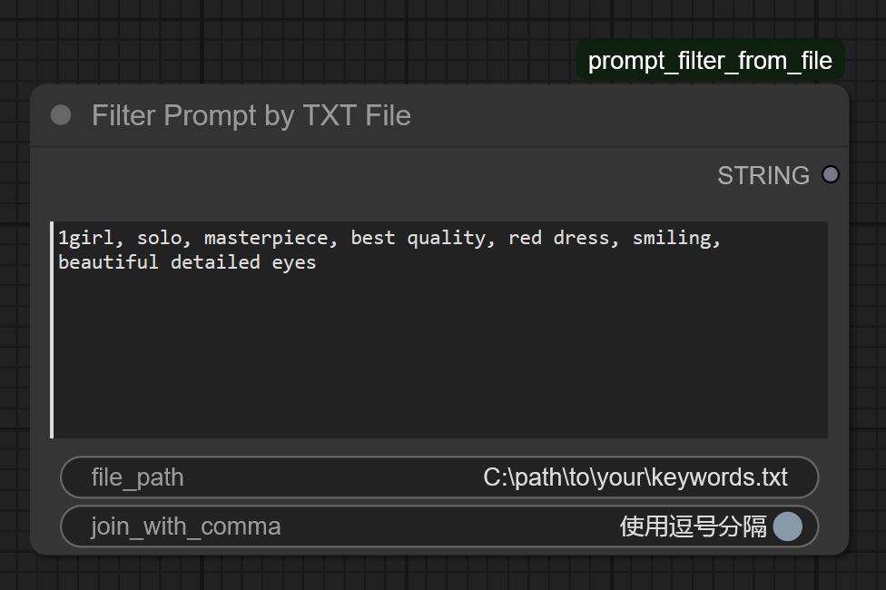
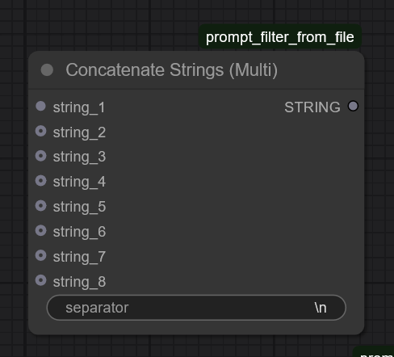
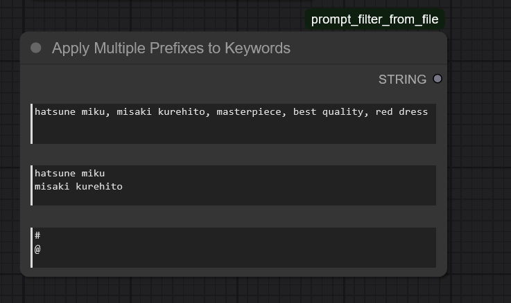
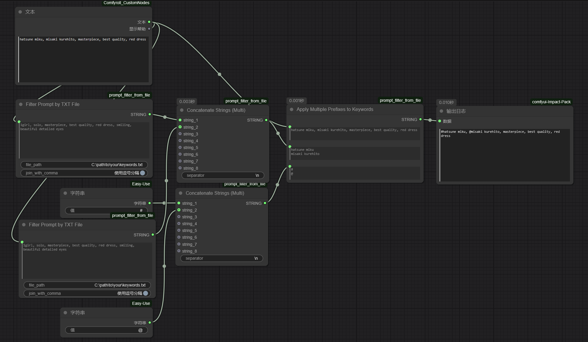

# ComfyUI-prompt-filter-nodes
这是几个依据写有需要识别的特定内容（每个内容只占一行）的txt文件来对输入的提示词内容进行特定内容的识别，并对识别到的内容添加特殊的前缀（作为标记）并放回原有提示词内容中的节点。

These nodes identifies specific content in the input prompt (each content occupies only one line) based on txt files containing predefined content that needs to be recognized. It then adds a special prefix (as a marker) to the identified content and inserts it back into the original prompt.

节点功能与示意工作流：（nodes function and workflow examples）

（1）filter prompt by txt file node

这个节点内容为“1girl”的文本框内用于输入整体prompt内容（可以从其他文件内导入），file_path内输入用于筛选特定内容的txt文件所在路径（其中识别txt文件路径需要为Windows的绝对路径，且txt文件的格式需要为一个内容一行的方式编排！）。join_with_comma启用后会使用逗号分隔识别结果（如果不启用则会以空格分隔识别结果）

This node contains a text box labeled "1girl" for inputting the overall prompt content (which can be imported from other files). The "file_path" field is used to input the path to the txt file containing the specific content for filtering (the path to the recognition txt file must be an absolute Windows path, and the txt file must be formatted with one content entry per line!). Enabling "join_with_comma" will separate the recognition results with commas (if not enabled, the results will be separated by spaces).

（2）Concatenate_Strings（Multi）node

这个节点主要是将多个识别结果（字符串格式）\需要添加的特定前缀以特定顺序分行排列好（本质与其他的文本联结节点完全一样，只是懒得用其他节点包而已）。其中separator中可输入不同输入结果间的分隔符（默认为换行符\n）。此处结果将分别输入Apply Multiple Prefixes to Keywords节点中。

This node primarily arranges multiple recognition results (in string format) and the specific prefixes to be added in a specified order, with each entry on a separate line (essentially functioning identically to other text concatenation nodes, but included here for convenience to avoid using additional node packages). The "separator" field allows input of a delimiter between different results (default is a newline character \n). The output here will be fed into the "Apply Multiple Prefixes to Keywords" node.

（3）Apply Multiple Prefixes to Keywords node

这个节点的作用是根据输入的识别结果将需要添加的特定前缀添加到整体prompt的特定内容中并输出添加特定前缀后的整体prompt。
由上至下三个文本框输入内容分别为：
（1）整体prompt内容
（2）过滤文件识别结果
（3）特定前缀添加内容（你可以直接在这里按一行一个前缀的格式输入，也可通过其他字符串节点整合成节点默认的格式后再一起输入进来）

The function of this node is to add specific prefixes to particular content within the overall prompt based on the input recognition results, and output the modified overall prompt with the added prefixes.
The three input fields from top to bottom are:  
(1) Overall prompt content  
(2) Filtered file recognition results  
(3) Specific prefix content (you may directly input prefixes here in the format of one prefix per line, or integrate them into the node's default format using other string nodes before inputting)  

（4）示例工作流（example workflow）（其中特定前缀的字符串节点也可以是其他节点包的节点，只要输出的是字符串就行）

(Note: The string node for specific prefixes can also be a node from other node packages, as long as it outputs a string.)

